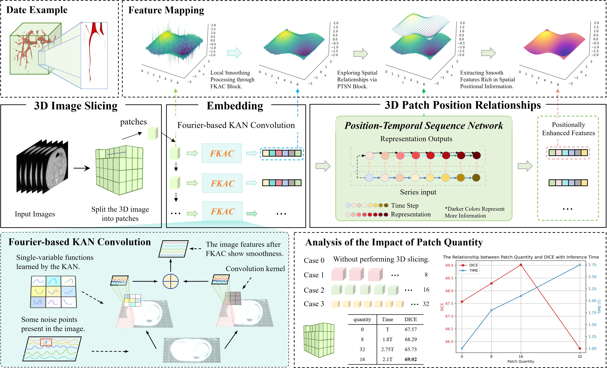
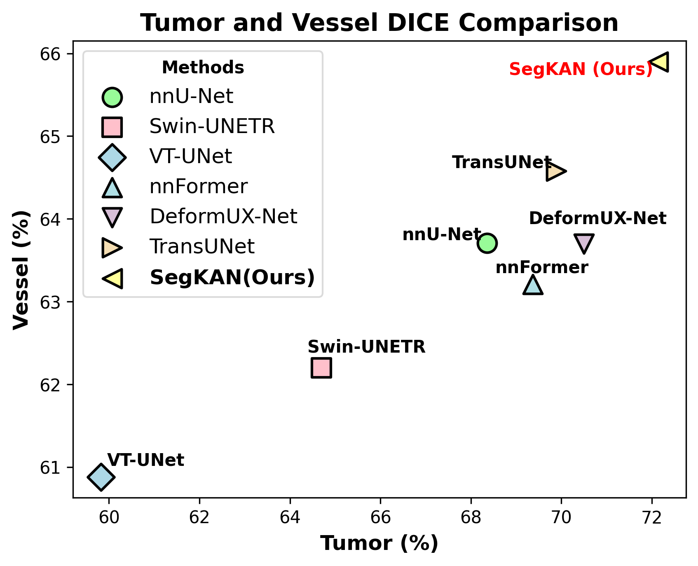

# SegKAN

This is the code repository for the paper:
> **SegKAN: High-Resolution Medical Image Segmentation with Long-Distance Dependencies**
>
> [Shengbo Tan](https://github.com/goblin327), [Rundong Xue](https://github.com/Yizhao-dong), Shipeng Luo, [Zeyu Zhang](https://steve-zeyu-zhang.github.io/)†, Xinran Wang, Lei Zhang, Daji Ergu, Zhang Yi, [Yang Zhao](https://yangyangkiki.github.io/) and [Ying Cai](https://ieeexplore.ieee.org/author/37087137422)\*
>
> \*Corresponding author †Project lead
> 
> **[[arXiv]](https://arxiv.org/abs/2412.19990)** **[[Paper with Code]](https://paperswithcode.com/paper/segkan-high-resolution-medical-image)**



## Citation

If you use any content of this repo for your work, please cite the following our paper:
```
@article{tan2024segkan,
  title={SegKAN: High-Resolution Medical Image Segmentation with Long-Distance Dependencies},
  author={Tan, Shengbo and Xue, Rundong and Luo, Shipeng and Zhang, Zeyu and Wang, Xinran and Zhang, Lei and Ergu, Daji and Yi, Zhang and Zhao, Yang and Cai, Ying},
  journal={arXiv preprint arXiv:2412.19990},
  year={2024}
}
```


## Introduction
Hepatic vessels in computed tomography scans often suffer from image fragmentation and noise interference, making it difficult to maintain vessel integrity and posing significant challenges for vessel segmentation. To address this issue, we propose an innovative model: SegKAN. First, we improve the conventional embedding module by adopting a novel convolutional network structure for image embedding, which smooths out image noise and prevents issues such as gradient explosion in subsequent stages. Next, we transform the spatial relationships between Patch blocks into temporal relationships to solve the problem of capturing positional relationships between Patch blocks in traditional Vision Transformer models. We conducted experiments on a Hepatic vessel dataset, and compared to the existing state-of-the-art model, the Dice score improved by 1.78\%. These results demonstrate that the proposed new structure effectively enhances the segmentation performance of high-resolution extended objects.
<div align="center">


Comparison of Tumor and Vessel Segmentation Results Across Different Models.
</div>


## Acknowledgements
Our method is implemented based on [nnUNET](https://github.com/MIC-DKFZ/nnUNet). We thank the authors for their open-source code.

